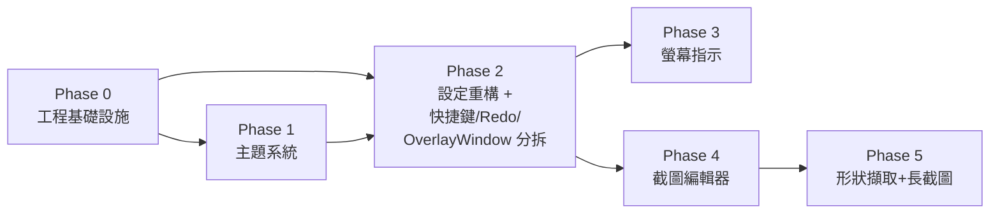

# DWAnnotation v1.2 系統升級規劃

> **版本**：規劃版 v0.3（審查補充完畢）  
> **建立日期**：2026-05-28  
> **最後更新**：2026-05-28  
> **規劃人**：AI 協作  
> **目標版本**：1.2.x（長截圖瀏覽器支援視複雜度移至 v1.3）

---

## 一、現況分析 (As-Is)

| 模組 | 現狀描述 |
|------|----------|
| 工具列 | 浮動視窗、可拖曳、固定尺寸、無自動縮小功能 |
| 繪圖工具 | Pen / Line / Rectangle / Ellipse / EraserPoint / EraserObject |
| 覆蓋層 | 全螢幕透明 InkCanvas，支援多螢幕 |
| 截圖 | 僅有「截全螢幕+標註合併」儲存，無截圖編輯器 |
| 設定視窗 | 單頁 ScrollViewer，項目固定，難以擴充 |
| 主題 | 單一淺色，使用 Hue 旋轉，對比度不足 |
| 螢幕指示 | 無雷射筆、無聚光燈、無放大鏡 |
| 架構 | 無日誌框架、無 DI 容器、Service 無介面抽象、無 .sln、無單元測試 |
| 快捷鍵 | 硬編碼 if-else 鏈（OverlayWindow code-behind），無 KeyBinding |
| 無障礙 | 無 AutomationProperties，螢幕閱讀器無法辨識按鈕 |
| 已知 Bug | GDI HBitmap 洩漏、Run Text Binding 預設 TwoWay、部分工具未走 Command |

---

## 二、需求疏漏與補充建議

### 補充建議（已納入規劃）

1. **截圖編輯器 Undo/Redo**：編輯器內需要獨立的 Undo/Redo 堆疊（與覆蓋層標註分開）
2. **截圖格式支援**：除 PNG 外，建議加入 JPG（可設品質）、BMP 選項
3. **長截圖技術選型**：需使用 `PrintWindow` + 捲動模擬，瀏覽器可能需要 CDP/Playwright；初期以 WPF 應用為主，瀏覽器長截圖標記為進階功能
4. **撕邊「中間」方向**：附圖 2 已有上/左/右/下方向，「中間撕邊」解釋為水平或垂直居中兩側均撕，規劃為水平/垂直雙向同時撕邊
5. **工具列縮小行為**：縮小時建議保留 icon 列（僅縮窄），滑鼠 hover 再展開完整面板，避免完全不可見
6. **主題管理**：以 ResourceDictionary 做主題包（Light / Dark），每個主題定義全套語義色票（Background / Surface / Primary / OnPrimary / Outline 等），不使用 Hue 旋轉
7. **設定視窗重構**：建議採用左側分類樹 + 右側內容面板（類似 VS Code Settings），方便後續新增設定分類

### 架構補強（v0.3 新增）

8. **GDI HBitmap 記憶體洩漏修復**：`CaptureScreenWithAnnotations` 中 `GetHbitmap()` 未呼叫 `DeleteObject`，長時間使用記憶體持續增長
9. **Run Text Binding 修正**：`<Run Text="{Binding}"/>` 預設 TwoWay，需加 `Mode=OneWay`
10. **MVVM 一致性修正**：Ellipse / EraserPoint / EraserObject 在 code-behind 直接設 `_viewModel.CurrentTool`，不像 Pen / Line / Rectangle 走 Command
11. **日誌框架**：引入 `Microsoft.Extensions.Logging`，對所有 catch 區塊記錄 warning/error
12. **DI 容器**：引入 `Microsoft.Extensions.DependencyInjection`，`App.xaml.cs` 建立 `ServiceProvider`
13. **Service 介面抽象**：`ISettingsService`、`IThemeService`、`IScreenshotService` 等，方便替換實作與測試
14. **建立 .sln 解決方案檔**：方便 IDE 管理與未來加入測試專案
15. **單元測試專案**：`DWAnnotation.Tests`（xUnit），對 Service 與 ViewModel 寫基本測試
16. **覆蓋層 Redo**：現有只有 Undo（`Ctrl+Z`），補上 Redo（`Ctrl+Y`）
17. **快捷鍵系統重構**：從硬編碼 if-else 改為 `KeyBinding` + `ICommand` 或集中式 `HotkeyService`
18. **OverlayWindow.xaml.cs 分拆**：目前 691 行，Phase 3 新增功能前需先拆分
19. **全域 DPI 感知策略**：不只長截圖，放大鏡等新功能也需統一的多螢幕 DPI 處理
20. **基礎無障礙功能**：工具列按鈕加入 `AutomationProperties.Name`

### 需求確認紀錄（2026-05-28 已定案）

| 項目 | 確認結果 | 實作方向 |
|------|----------|----------|
| §1.5 長截圖-瀏覽器支援 | ✅ 需要，過度複雜可移至 v1.3 | Phase 5a：WPF 視窗捲動截圖；Phase 5b（v1.3）：瀏覽器 CDP/Playwright |
| §1.6.5 指定視窗/物件 | ✅ 需要，選取物件後以紅框（顏色可設定）標示 | UI Automation API 掃描可見元素，Hover 高亮 + 點擊選取，顏色存入設定 |
| §5.3 放大鏡 | ✅ 即時跟隨滑鼠（不影響背後系統運作） | 獨立透明置頂視窗，`VisualBrush` 擷取螢幕局部區域即時放大 |
| 暗黑模式預設值 | ✅ 明亮為預設，設定中可切換 | `ThemeName: "Light"` 為預設值，設定頁提供明亮/暗黑切換 |

---

## 三、功能分類與難易度評估

| 功能 | 難度 | 說明 |
|------|------|------|
| 版號升級 + .sln 建立 | ★☆☆☆☆ | 開工即升級 version.json，建立解決方案檔 |
| GDI 洩漏修復 + Binding 修正 | ★☆☆☆☆ | 小範圍程式碼修正 |
| 日誌 + DI 基礎設施 | ★★☆☆☆ | 引入 NuGet + 改造 App.xaml.cs 啟動流程 |
| Service 介面抽象 | ★★☆☆☆ | 抽取介面 + DI 註冊 |
| 基礎無障礙功能 | ★☆☆☆☆ | XAML 加 AutomationProperties |
| UI 重構 + 主題系統（§3） | ★★★☆☆ | ResourceDictionary 主題包，影響全域 |
| 設定視窗重構（§4） | ★★★☆☆ | 架構改變，需重新設計 ViewModel |
| 工具列自動縮小（§2.1） | ★★☆☆☆ | 偵測 Top 位置 + MouseEnter/Leave |
| 漸層按鈕圖示更換（§2.2） | ★☆☆☆☆ | 純 UI 資源替換 |
| 快捷鍵系統重構 | ★★☆☆☆ | KeyBinding + ICommand 機制 |
| 覆蓋層 Redo + MVVM 修正 | ★★☆☆☆ | Undo/Redo 堆疊 + Command 統一 |
| OverlayWindow 分拆 | ★★☆☆☆ | 抽出 Helper/Behavior 類別 |
| 雷射筆（§5.1） | ★★☆☆☆ | 覆蓋層繪製 + 動態拖尾效果 |
| 聚光燈（§5.2） | ★★★☆☆ | 遮罩層 + 裁剪區域動畫 |
| 放大鏡（§5.3） | ★★★☆☆ | VisualBrush 局部放大 + 跟隨視窗 |
| 截圖編輯器基礎（§1）  | ★★★★☆ | 新 Window + 標記工具集 |
| 截圖編輯器邊緣效果（§1.1）| ★★★☆☆ | 自訂 WriteableBitmap 像素處理 |
| 截圖形狀擷取（§1.6） | ★★★☆☆ | 區域選取 + Polygon mask |
| 長截圖（§1.5） | ★★★★★ | 捲動模擬 + 拼接，技術風險最高 |
| 單元測試 | ★★☆☆☆ | 每 Phase 完成後補寫對應測試 |

---

## 四、執行階段規劃

### Phase 0 — 工程基礎設施（開工即做）
> 估計工時：0.5 session

**目標**：升級版號、建立解決方案檔、修復已知 Bug、引入日誌與 DI 基礎。

- [ ] 升級 `version.json` 版號至 `1.2`
- [ ] 建立 `DWAnnotation.sln` 解決方案檔
- [ ] 建立 `DWAnnotation.Tests` 測試專案（xUnit），加入 sln
- [ ] **GDI HBitmap 洩漏修復**
  - `OverlayWindow.xaml.cs` → `CaptureScreenWithAnnotations()` 中 `GetHbitmap()` 後加入 `DeleteObject` 釋放
  - 引入 `[DllImport("gdi32.dll")] static extern bool DeleteObject(IntPtr hObject);`
- [ ] **Run Text Binding 修正**：檢查所有 `<Run Text="{Binding}"/>`，加上 `Mode=OneWay`
- [ ] **引入日誌框架**
  - NuGet：`Microsoft.Extensions.Logging` + `Microsoft.Extensions.Logging.Debug`
  - 所有現有空 catch 區塊加入 `logger.LogWarning` / `logger.LogError`
- [ ] **引入 DI 容器**
  - NuGet：`Microsoft.Extensions.DependencyInjection`
  - `App.xaml.cs` 建立 `ServiceCollection` → `ServiceProvider`
  - 註冊 `ISettingsService` → `SettingsService`（抽取介面）
  - ViewModel 改為 DI 解析
- [ ] **修正 README.md** 設定檔路徑描述（與實際程式碼一致）

---

### Phase 1 — UI 基礎重構（低風險、高價值）
> 估計工時：1~2 session

**目標**：建立現代化主題系統，作為後續所有功能的視覺基礎。

- [ ] §3.1 建立 `Themes/` 目錄，新增 `LightTheme.xaml` / `DarkTheme.xaml`
  - 語義色票：`AppBackground`, `AppSurface`, `AppPrimary`, `AppOnPrimary`, `AppSecondary`, `AppOutline`, `AppText`, `AppTextMuted`
  - 配色參考：https://www.ysdaima.com/palettes/ui-chart-category/
- [ ] §3.2 重構 `MainToolbarWindow.xaml`（套用主題色票）
  - 所有按鈕加入 `AutomationProperties.Name`（基礎無障礙）
- [ ] §3.2 重構 `OverlayWindow.xaml`（若有可見元素）
- [ ] §2.2 更換漸層按鈕圖示（改用 Path/SVG 幾何圖形）
- [ ] `App.xaml` 加入主題切換支援（靜態屬性 + `MergedDictionaries`）
- [ ] 新增 `IThemeService` / `ThemeService`，註冊至 DI
- [ ] Phase 1 單元測試：`ThemeService` 基礎測試

---

### Phase 2 — 設定視窗重構 + 工具列優化 + 基礎重構
> 估計工時：2~3 session

**目標**：現代化設定架構；工具列智慧縮小；重構快捷鍵、Undo/Redo、OverlayWindow。

- [ ] §4 重構 `SettingsWindow`：左側 `TreeView`/`ListBox` 分類 + 右側動態 `ContentControl`
  - 各分類頁面以 `UserControl` 實作（`GeneralSettingsPage`, `PenSettingsPage`, `ScreenshotSettingsPage` 等）
  - `SettingsViewModel` 改為聚合型（包含各子 ViewModel）
- [ ] §2.1 工具列自動縮小功能
  - 偵測 `Window.Top < threshold`（如 50px）時啟用「靠頂縮小」模式
  - `MouseEnter` 展開，`MouseLeave` 延遲收起（200ms debounce）
  - §2.1.1 設定項：`ToolbarAutoCollapseEnabled`（bool）
- [ ] **MVVM 一致性修正**
  - Ellipse / EraserPoint / EraserObject 改為走 `RelayCommand`，與 Pen / Line / Rectangle 一致
- [ ] **快捷鍵系統重構**
  - 將 `OverlayWindow_PreviewKeyDown` 的 if-else 鏈改為 `KeyBinding` + `ICommand`
  - 或建立 `HotkeyService` 集中管理快捷鍵對應表
- [ ] **覆蓋層 Undo/Redo 完善**
  - 現有 Undo 堆疊改為雙堆疊（Undo + Redo）
  - 加入 `Ctrl+Y` Redo 快捷鍵
  - 採 Command Pattern（`IEditCommand` 介面），與 Phase 4 截圖編輯器共用設計
- [ ] **OverlayWindow.xaml.cs 分拆**（為 Phase 3 做準備）
  - 繪圖邏輯 → `Helpers/DrawingHelper.cs` 或 `Behaviors/DrawingBehavior.cs`
  - 截圖邏輯 → `Services/ScreenshotService.cs`（抽取 `IScreenshotService` 介面）
  - 形狀生成 → `Helpers/ShapeGenerator.cs`
  - 目標：OverlayWindow.xaml.cs 降至 ~200 行以下
- [ ] `AppSettings` 新增對應欄位
- [ ] Phase 2 單元測試：`ScreenshotService`、`HotkeyService`（或 Command 測試）、Undo/Redo 堆疊

---

### Phase 3 — 螢幕指示功能
> 估計工時：1~2 session

**目標**：新增雷射筆、聚光燈、放大鏡，強化簡報場景。

- [ ] §5.1 雷射筆指示器
  - 覆蓋層 `Canvas` 上繪製紅色光點 + 拖尾（使用 `DispatcherTimer` 淡出）
  - 工具列新增「雷射筆」按鈕（含 `AutomationProperties.Name`）
  - 設定：`LaserPointerColor`（預設紅色）
- [ ] §5.2 聚光燈功能
  - 全螢幕半透明遮罩，中央裁剪圓形或正方形明亮區
  - §5.2.1 設定：形狀（Circle/Square）、大小（半徑 px）、遮罩透明度（`SpotlightOpacity`）
  - 使用 `CombinedGeometry` 或 `OpacityMask` 實作
- [ ] §5.3 放大鏡功能（即時跟隨滑鼠）
  - 獨立透明置頂視窗（`Topmost=True`, `AllowsTransparency=True`），跟隨滑鼠位置
  - 使用 `CopyFromScreen` 擷取滑鼠周圍區域，放大後顯示（`VisualBrush` 或 GDI+ 放大）
  - 遮罩不影響背後系統，鍵盤/滑鼠事件穿透（`WS_EX_TRANSPARENT`）
  - 設定：放大鏡大小（直徑 px）、放大倍率（1x ~ 8x）、形狀（`MagnifierShape`：Circle/Square）
  - **注意**：多螢幕 DPI 差異需套用全域 DPI 策略（見技術注意事項）
- [ ] Phase 3 單元測試：指示器相關 ViewModel 測試

---

### Phase 4 — 截圖編輯器（核心）
> 估計工時：3~4 session

**目標**：實作截圖後可進入的圖像編輯器（類 FastStone Capture）。

- [ ] §1 新增 `ScreenshotEditorWindow.xaml`
  - 主要元件：`Image`（底圖） + `Canvas`（標記層） + 工具列
  - 支援 Undo/Redo（獨立堆疊，共用 Phase 2 的 `IEditCommand` 介面）
  - 獨立快捷鍵表（裁切、旋轉、特效套用等），避免與覆蓋層衝突
- [ ] §1.1 邊緣效果面板（`EdgeEffectsPanel`）
  - 陰影邊緣（`DropShadowEffect`）
  - 撕裂邊緣（WriteableBitmap 像素處理，鋸齒/隨機裁剪）
    - 方向：上 / 下 / 左 / 右 / 中間（水平+垂直）
    - 大小：可調整（1~30px）
  - 漸層邊緣（LinearGradientBrush mask）
  - 水印圖像（疊加半透明文字或圖）
  - 預覽面板（即時預覽效果）
- [ ] §1.1 聚光燈 + 模糊效果（編輯器內）
  - 聚光燈遮罩（同 §5.2 但作用在圖像層）
  - `BlurEffect` 區域模糊（選取矩形後套用）
- [ ] §1.2 設定：截圖後是否進入編輯器（`OpenEditorAfterCapture: bool`）
- [ ] §1.3 設定：截圖自動存檔路徑（`AutoSavePath: string`）
- [ ] §1.4 設定：截圖後是否複製到剪貼簿（`CopyToClipboardAfterCapture: bool`）
- [ ] Phase 4 單元測試：`ScreenshotEditorViewModel`、邊緣效果邏輯

---

### Phase 5 — 截圖形狀擷取 + 長截圖
> 估計工時：3~5 session（5a WPF 長截圖 + 5b 瀏覽器長截圖視情況移至 v1.3）

**目標**：豐富截圖模式，支援多種擷取形狀與滾動截圖。

- [ ] §1.6 擷取形狀支援
  - §1.6.1 任意繪製矩形（拖曳選取，現有能力擴充）
  - §1.6.2 指定大小矩形（輸入寬高後截取）
  - §1.6.3 隨意繪製形狀（Polygon lasso，截取後 mask）
  - §1.6.4 作用中視窗（`GetForegroundWindow` + `GetWindowRect`）
  - §1.6.5 指定視窗或物件
    - 使用 `UI Automation`（`AutomationElement`）掃描可見元素
    - 滑鼠 Hover 時以半透明紅框（預設）高亮物件邊界
    - 點擊後截取該物件範圍，框線顏色可在設定中調整（`WindowHighlightColor`）
- [ ] §1.5 長截圖功能（Phase 5a）
  - 選取畫面區塊（矩形選取）
  - 自動捲動目標視窗（`SendMessage WM_SCROLL` / `SetScrollPos`）並分段截圖拼接
  - DPI 縮放係數補正（套用全域 DPI 策略）
- [ ] §1.5 瀏覽器長截圖（Phase 5b，視複雜度移至 v1.3）
  - 評估 Chrome DevTools Protocol（CDP）或 Playwright 整合
  - 若整合成本過高，改以 Edge/Chrome 擴充功能呼叫本地 API 協作
- [ ] Phase 5 單元測試：`ScrollingScreenshotService`、形狀擷取邏輯

---

## 五、技術注意事項

### 日誌與 DI 架構
- 使用 `Microsoft.Extensions.DependencyInjection` + `Microsoft.Extensions.Logging`
- `App.xaml.cs` 建立 `IServiceProvider`，所有 Service/ViewModel 透過 DI 解析
- Service 層一律定義介面（`ISettingsService`、`IThemeService`、`IScreenshotService` 等）
- 日誌 provider 初期用 `Debug`，後續可擴充 file logger

### 主題系統
- 使用 `ResourceDictionary` `MergedDictionaries` 動態切換，**不使用** Hue/HSL 旋轉
- 每個主題定義完整語義色票，暗黑模式需單獨設計以確保對比度
- `AppSettings` 新增 `ThemeName: string`（預設 `"Light"`）

### 截圖編輯器
- `WriteableBitmap` 用於像素級操作（撕邊效果）
- 編輯器 Undo/Redo 採 Command Pattern（`IEditCommand` 介面），與覆蓋層共用設計
- 底圖保持原始解析度，Canvas 疊加層以 `ScaleTransform` 對齊
- 編輯器快捷鍵獨立於覆蓋層，避免衝突

### 工具列縮小
- 使用 `Window.LocationChanged` 事件偵測 `Top` 位置
- 動畫採 `DoubleAnimation`（`Window.Width` 或 `Column.Width`）
- 縮小狀態下仍顯示 icon strip（約 32px 寬），不完全隱藏

### 全域 DPI 感知策略
- 所有涉及螢幕座標的功能（截圖、放大鏡、長截圖、形狀擷取）需統一處理多螢幕 DPI
- 建立 `DpiHelper` 工具類別，封裝 `VisualTreeHelper.GetDpi()` 與 Win32 `GetDpiForMonitor`
- 避免各功能各自實作 DPI 轉換邏輯

### 長截圖（風險項）
- `PrintWindow` 可截取最小化或遮擋的視窗
- 捲動量需考慮 DPI 縮放（透過 `DpiHelper` 統一處理）
- 拼接使用 `Graphics.DrawImage` 垂直堆疊

### OverlayWindow 分拆策略
- 繪圖邏輯（Mouse 事件 → Stroke 生成）→ `DrawingHelper` 或 `DrawingBehavior`
- 截圖邏輯（`CaptureScreenWithAnnotations`）→ `IScreenshotService`
- 形狀點集生成（Line/Rectangle/Ellipse points）→ `ShapeGenerator`
- 淡出效果（MagicPen `FadeOutStrokeAsync`）→ `StrokeAnimationHelper`
- 目標：code-behind 僅保留視窗生命週期管理與 UI 事件轉發

---

## 六、AppSettings 新增欄位規劃

```csharp
// Phase 1
public string ThemeName { get; set; } = "Light";

// Phase 2
public bool ToolbarAutoCollapseEnabled { get; set; } = true;

// Phase 3
public bool LaserPointerEnabled { get; set; } = false;
public string LaserPointerColor { get; set; } = "#FFFF0000"; // 雷射筆顏色
public SpotlightShape SpotlightShape { get; set; } = SpotlightShape.Circle;
public int SpotlightRadius { get; set; } = 150;
public double SpotlightOpacity { get; set; } = 0.8;          // 遮罩透明度
public int MagnifierSize { get; set; } = 200;                 // 直徑 px
public double MagnifierZoom { get; set; } = 2.0;              // 放大倍率 (1~8)
public MagnifierShape MagnifierShape { get; set; } = MagnifierShape.Circle; // 放大鏡形狀

// Phase 4
public bool OpenEditorAfterCapture { get; set; } = true;
public string AutoSavePath { get; set; } = "";
public bool CopyToClipboardAfterCapture { get; set; } = false;
public string ScreenshotFormat { get; set; } = "PNG"; // PNG / JPG / BMP / WebP
public int JpgQuality { get; set; } = 90;

// Phase 5
public string WindowHighlightColor { get; set; } = "#FFFF0000"; // §1.6.5 物件選取框線顏色
```

---

## 七、檔案結構變動預覽

```
DWAnnotation.sln                         [NEW]
DWAnnotation/
├── Themes/                              [NEW]
│   ├── LightTheme.xaml
│   └── DarkTheme.xaml
├── Helpers/                             [NEW]
│   ├── DrawingHelper.cs                 — 繪圖邏輯（從 OverlayWindow 抽出）
│   ├── ShapeGenerator.cs                — 形狀點集生成
│   ├── StrokeAnimationHelper.cs         — MagicPen 淡出效果
│   └── DpiHelper.cs                     — 全域 DPI 轉換工具
├── Views/
│   ├── MainToolbarWindow.xaml           [MODIFY] - 主題套用、工具列縮小、AutomationProperties
│   ├── SettingsWindow.xaml              [MODIFY] - 重構為分類面板
│   ├── SettingsPages/                   [NEW]
│   │   ├── GeneralSettingsPage.xaml
│   │   ├── PenSettingsPage.xaml
│   │   ├── ScreenshotSettingsPage.xaml
│   │   └── IndicatorSettingsPage.xaml
│   ├── ScreenshotEditorWindow.xaml      [NEW]
│   └── OverlayWindow.xaml               [MODIFY] - 瘦身、新增雷射筆/聚光燈層
├── ViewModels/
│   ├── SettingsViewModel.cs             [MODIFY] - 聚合子 ViewModel
│   ├── ScreenshotEditorViewModel.cs     [NEW]
│   └── IndicatorViewModel.cs            [NEW]
├── Models/
│   ├── AppSettings.cs                   [MODIFY] - 新增欄位
│   ├── DrawingTool.cs                   [MODIFY] - 新增 LaserPointer, Spotlight, Magnifier
│   └── IEditCommand.cs                  [NEW] - Undo/Redo Command Pattern 介面
├── Services/
│   ├── ISettingsService.cs              [NEW] - 介面
│   ├── SettingsService.cs               [MODIFY] - 實作介面
│   ├── IScreenshotService.cs            [NEW] - 介面
│   ├── ScreenshotService.cs             [NEW] - 截圖邏輯（從 OverlayWindow 抽出）
│   ├── IThemeService.cs                 [NEW] - 介面
│   ├── ThemeService.cs                  [NEW] - 主題切換
│   ├── HotkeyService.cs                 [NEW] - 快捷鍵集中管理
│   └── ScrollingScreenshotService.cs    [NEW] - 長截圖
└── App.xaml.cs                          [MODIFY] - DI 容器 + 日誌初始化

DWAnnotation.Tests/                      [NEW]
├── DWAnnotation.Tests.csproj
├── Services/
│   ├── ThemeServiceTests.cs
│   ├── ScreenshotServiceTests.cs
│   └── HotkeyServiceTests.cs
└── ViewModels/
    └── ScreenshotEditorViewModelTests.cs
```

---

## 八、Phase 依賴關係



**關鍵依賴**：
- Phase 0 的 DI/日誌是所有後續 Phase 新增 Service 的前提
- Phase 2 的設定架構是 Phase 3/4/5 新增設定頁的前提
- Phase 2 的 OverlayWindow 分拆是 Phase 3 新增覆蓋層功能的前提
- Phase 2 的 `IEditCommand` 設計是 Phase 4 截圖編輯器 Undo/Redo 的前提

---

*本文件為 AI 輔助規劃，執行細節以 Handoff.md 中各階段記錄為準。*
